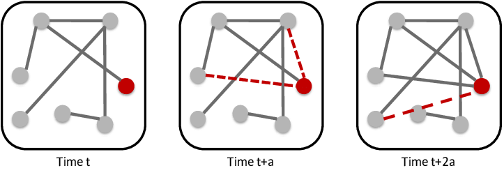

# Data Science with Neo4j

This notebook walks you through connecting a Neo4j database on a Sandbox, data analysis on [citation dataset](https://www.aminer.org/citation), recommendations using graph algorithms, prediction of nodes linkage. The content is used from [Neo4j Online Training](https://neo4j.com/graphacademy/online-training/). Additionally links to algorithm documentations and articles are provided.

Workflow -

#### Environment Setup
* Import Modules
* Start a Sandbox
* Connect to Sandbox

#### EDA
* Query a database for its schema
* Stat of node labels and relationship types
* Stat of papers and their citations

#### Recommendation System
* Collaborative Filtering: Find potential collaborators for an author
* PageRank
* Personalized PageRank

#### Predictions
* Train & Test Data
* Feature Generation
* Link Prediction Algorithm
* Community Detection Algorithms
* ML model using sklearn

